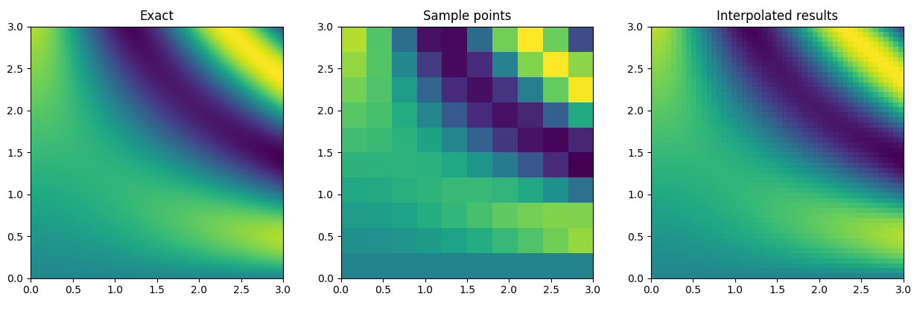

[](https://travis-ci.org/thearn/SGNDI)
[](https://coveralls.io/github/thearn/SGNDI?branch=master)

Separable Grid N-Dimensional Interpolator (SGDNI)
-------------------------------------------------



A multi-dimensional interpolating class with first-order gradients.
This module provides a class `SeparableGridNDInterpolator` similair in
interface to the interpolators provided by [`scipy.interpolate`](https://docs.scipy.org/doc/scipy/reference/interpolate.html).

This class provides interpolation on a regular grid in arbitrary dimensions, by applying
a selected 1D interpolation class on each grid axis sequentially. These
1D interpolation classes are the ones provided by [`scipy.interpolate`](https://docs.scipy.org/doc/scipy/reference/interpolate.html), such
as [`CubicSpline`](https://docs.scipy.org/doc/scipy/reference/generated/scipy.interpolate.CubicSpline.html#scipy.interpolate.CubicSpline), [`UnivariateSpline`](https://docs.scipy.org/doc/scipy/reference/generated/scipy.interpolate.UnivariateSpline.html#scipy.interpolate.UnivariateSpline), or [`Akima1DInterpolator`](https://docs.scipy.org/doc/scipy/reference/generated/scipy.interpolate.Akima1DInterpolator.html#scipy.interpolate.Akima1DInterpolator). By default, `CubicSpline` is used if no interpolator is specified.

This method can be considered a generalization of the class of multidimensional interpolators that operate on each dimension sequentially, such as [bilinear](https://en.wikipedia.org/wiki/Bilinear_interpolation), [bicubic](https://en.wikipedia.org/wiki/Bicubic_interpolation), [trilinear](https://en.wikipedia.org/wiki/Trilinear_interpolation), [tricubic](https://en.wikipedia.org/wiki/Tricubic_interpolation), etc. In other words, is provides n-linear, n-cubic, etc. interpolation capabilities within a single class.

If derivatives are provided by the chosen 1D interpolation method, then
a gradient vector of the multidimensional interpolation may be computed
and and cached when the interpolation is performed. This can then be accessed by the `derivative` method. At the moment, only
first-order derivatives are supported.

Examples
---------
The shortest example might be fitting the XOR function:

```python
import numpy as np
from sgndi import SeparableGridNDInterpolator

a = np.array([0, 1])
b = np.array([0, 1])

c = np.array([[0, 1], [1, 0]])

cs = SeparableGridNDInterpolator([a, b], c)

x = [0.8,0.1]

value = cs(x)
gradient = cs.derivative(x)

print(value, gradient)
```

which prints the interpolated value, and gradient vector

```0.7400000000000001, [ 0.8 -0.6]```

-------------------

A more ambitious 4D paraboloid example, using `np.meshgrid` to create the structured (regular) grid:


```python
import numpy as np
from sgndi import SeparableGridNDInterpolator

# Let's define a 4D function to test with:

def F(u,v,z,w):
	return (u-5)**2 + (v-2)**2 + (z-5)**2 + (w-0.5)**2

# Now create 1D arrays for each of the function parameters for sampling.

U = np.linspace(0, 10, 10)
V = np.linspace(0, 4, 6)
Z = np.linspace(0, 10, 7)
W = np.linspace(0, 1, 8)
points = [U, V, Z, W]

# Create coordinate mesh

u, v, z, w = np.meshgrid(*points, indexing='ij')

# Now create the 4D value array

values = F(u, v, z, w)

# Define a random point to interpolate at

x = [5.26434, 2.121235, 2.7352, 0.5213345]

# Create the interpolation class instance

interp = SeparableGridNDInterpolator(points, values)

# Call the interpolation at the point above, which by default also
# computes the gradient of the interpolant at this point

def dF(u,v,z,w):
	# the actual gradient
	return 2*(u-5), 2*(v-2), 2*(z-5), 2*(w-0.5)

f = interp(x)
dfdx = interp.derivative(x)

print("actual value", F(*x))
print("computed value", f)
print("actual gradient:", dF(*x))
print("computed gradient:", dfdx)
```

This produces the interpolated output:

```
actual value 5.21434776171525
computed value 5.214347761715252
actual gradient: (0.5286799999999996, 0.24246999999999996, -4.5296, 0.04266900000000007)
computed gradient: [ 0.52868   0.24247  -4.5296    0.042669]
```

---------------------------------

A 2D example can show the performance visually. A very course sampling is used to product a 2D interpolation, making use of the 1D `UnivariateSpline` from scipy.interpolate with degree `k=5`. This is then used to produce a finer-scale approximation of the original function.

```python
import numpy as np
from sgndi import SeparableGridNDInterpolator
from scipy.interpolate import UnivariateSpline
import matplotlib.pyplot as plt

def F(u,v):
    return u*np.cos(u*v) + v*np.sin(u*v)

def dF(u,v):
    return -u*v*np.sin(u*v) + v**2*np.cos(u*v) + np.cos(u*v), -u**2*np.sin(u*v) + u*v*np.cos(u*v) + np.sin(u*v)

# Plot exact function, with high sampling, n = 200
U = np.linspace(0, 3, 200)
V = np.linspace(0, 3, 200)

points = [U, V]

u, v = np.meshgrid(*points, indexing='ij')

values = F(u, v)
plt.subplot(131)
plt.imshow(values[::-1], extent=(U[0], U[-1], V[0], V[-1]))

#--------------------------------
# Now gather & plot a very course sample for creating the interpolant, n = 10

U = np.linspace(0, 3, 10)
V = np.linspace(0, 3, 10)

points = [U, V]

u, v = np.meshgrid(*points, indexing='ij')

values = F(u, v)
plt.subplot(132)
plt.imshow(values[::-1], extent=(U[0], U[-1], V[0], V[-1]))

interp = SeparableGridNDInterpolator(points, values,
				interpolator = UnivariateSpline, interp_kwargs = {'k' : 5})

#--------------------------------
# Test that the created interpolator can actually approximate a fine level
# of detail, n = 50

U = np.linspace(0, 3, 50)
V = np.linspace(0, 3, 50)

points = [U, V]

u, v = np.meshgrid(*points, indexing='ij')

vals = []
for x in np.array([u.ravel(), v.ravel()]).T:
    f = interp(x)
    vals.append(f)

A = np.array(vals).reshape(50, 50)

plt.subplot(133)
plt.imshow(A[::-1], extent=(U[0], U[-1], V[0], V[-1]))

plt.show()
```

Which gives the plot shown at the top of this readme.

Example use in a numerical optimization
------------------------------
```python
import numpy as np
from scipy.optimize import fmin_bfgs
from sgndi import SeparableGridNDInterpolator

def F(u, v, z, w):
    # min at u=5.234 v=2.128 z=5.531 w=0.574
    return (u - 5.234)**2 + (v - 2.128)**2 + (z - 5.531)**2 + (w - 0.574)**2

U = np.linspace(0, 10, 10)
V = np.linspace(0, 10, 6)
Z = np.linspace(0, 10, 7)
W = np.linspace(0, 10, 8)

points = [U, V, Z, W]

u, v, z, w = np.meshgrid(*points, indexing='ij')

values = F(u, v, z, w)

interp = SeparableGridNDInterpolator(points, values)

x = np.zeros(4)
```

Without gradients:
```
print(fmin_bfgs(interp, x))
```

```
Optimization terminated successfully.
         Current function value: 0.000000
         Iterations: 3
         Function evaluations: 24
         Gradient evaluations: 4
[ 5.23399953  2.12799974  5.53100043  0.57400106]
```

With gradients:
```
print(fmin_bfgs(interp, x, fprime=interp.derivative))
```

```
Optimization terminated successfully.
         Current function value: 0.000000
         Iterations: 3
         Function evaluations: 4
         Gradient evaluations: 4
[ 5.234  2.128  5.531  0.574]
```

Limitations
------------
- The interpolation can only be called one evaluation point at a time. I am working
on vectorizing this to allow for a collection of points to be interpolated at once.
- Only first-order derivatives (gradients) are computed.


